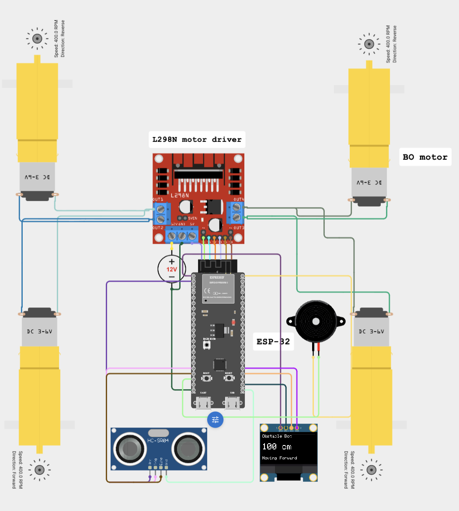

# Build Journal

## Day 1 – Circuit Design

- Created the robot circuit in Cirkit Designer.
- Added the ESP32-S3 as the main controller.
- Connected the L298N motor driver to four DC motors.
- Wired the HC-SR04 ultrasonic sensor for obstacle detection.
- Added an I2C OLED display (SDA: GPIO21, SCL: GPIO20) to display distance readings.
- Connected an active buzzer for obstacle alerts.
- Verified that all components shared a common ground and that the L298N was powered by a 12V supply.

## Day 2 – Firmware & Simulation

- Wrote the firmware for the ESP32-S3 using the Arduino framework.
- Implemented motor control functions for forward, reverse, stop, left, and right movement.
- Added ultrasonic distance measurement and obstacle detection logic.
- Programmed the robot to stop, sound the buzzer, reverse for one second, and continue moving when an obstacle is detected within 20 cm.
- Displayed live distance measurements on the OLED.
- Tested the complete behavior in the Cirkit Designer simulator and verified that the robot responded correctly to obstacles.

